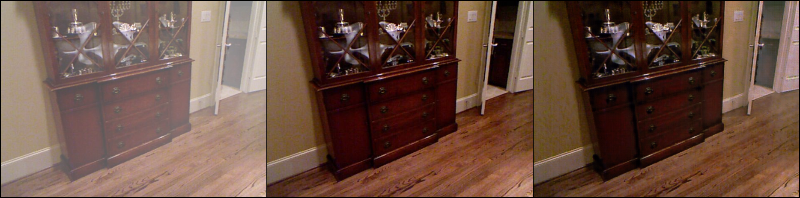
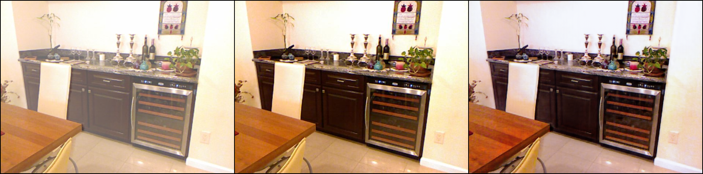

# Attention Based CycleDehaze

End-to-end CycleGAN architecture with attention-based network for Unpaired Single Image
Dehazing. Official Pytorch based implementation.


## Dependencies

- Python 3
- PyTorch >= 1.0
- NVIDIA GPU+CUDA

## Dataset
Dataset used : [RESIDE](https://sites.google.com/view/reside-dehaze-datasets/)
## Usage
### Train
Unzip `DCNv2_latest.zip` and build the files.
Train the model in `ITS` dataset.   

```bash
python main.py
```
### Test
Put your images in `input`. 

```bash
python main.py --eval
```
the dehazed image will be saved at `output`
## Sample




