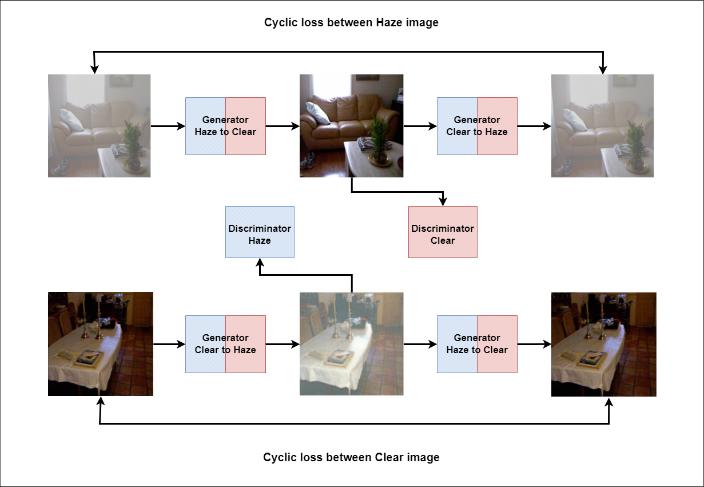
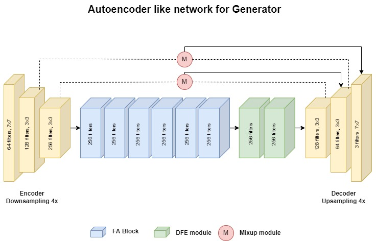

# Attention Based CycleDehaze

Attention-based Single Image Dehazing Using Improved CycleGAN, IJCN IEEE WCCI 2022. Official Pytorch based implementation.

## Model Architecture




## Dependencies

- Python 3
- PyTorch >= 1.0
- NVIDIA GPU+CUDA

## Dataset

Dataset used : [RESIDE](https://sites.google.com/view/reside-dehaze-datasets/)

<details>
<summary> File Structure </summary>

```
project
│   README.md
│   dataset.py
│   main.py
│   metrics.py
│   option.py
│   utility.py
└───inputs   
|
└───outputs   
|   
└───models   
|   |   dehaze.py
|   |   dicriminator.py
|   |   generator.py
|   └───DCNv2_latest   
|      
└───data
│   └───haze
│   |   |   *.png
│   |   
│   └───clear
│   |   |   *.png
│   |   
│   └───SOTS
│       └───indoor
│       |   └───haze
│       |   |   |   *.png
│       |   |   
│       |   └───clear
│       |       |   *.png
│       |       
│       └───indoor
│           └───haze
│           |   |   *.png
│           |   
│           └───clear
│               |   *.png
|
└───trained_models
```

</details>


## Metrics update

|Methods|Indoor(PSNR/SSIM)|Outdoor(PSNR/SSIM)|
|-|-|-|
|**Paired Models**|-|-|
|AOD-NET|19.06/0.8504|20.29/0.8765|
|DehazeNet|21.14/0.8472|22.46/0.8514|
|FFA-Net|36.39/0.9886|33.57/0.9840|
|**Unpaired Models**|-|-|
|DCP|16.62/0.8179|19.13/0.8148|
|Improved CycleGAN (with ssim loss)|20.05/0.8307|21.14/0.8919|
|Dehaze-GLCGAN|23.03/0.9165|26.51/0.9354|
|Ours|31.67/0.9612|36.17/0.9745|

## Usage

### Train

Unzip `DCNv2_latest.zip` inside models and build the files.
Train the model in `ITS` dataset.

```bash
python main.py
```

### Test

Put your images in `input`.

```bash
python main.py --eval
```

the dehazed image will be saved at `output`

## Sample


## Acknowledgements

The code for DCN module implementation in PyTorch has been taken from <a href="https://github.com/jinfagang/DCNv2_latest">DCNv2_latest</a>.
